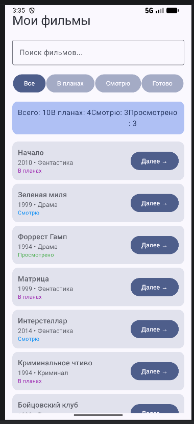

# Watchlist App

## Автор и группа

Манычкин Артём Евгеньевич
Б9124-09.03.03пикд(4).

## Тема

Приложение для ведения личного списка фильмов с циклической сменой статуса: в планах -> смотрю -> просмотрено.

## Что умеет

1. Поиск фильмов по названию.
2. Фильтрация по статусам (все / в планах / смотрю / просмотрено).
3. Циклическое изменение статуса для каждой карточки.
4. Подсчёт статистики по текущей выборке (всего, в планах, смотрю, просмотрено).
5. Полностью офлайн: данные лежат в коде, без сети и БД.

## Скриншоты

